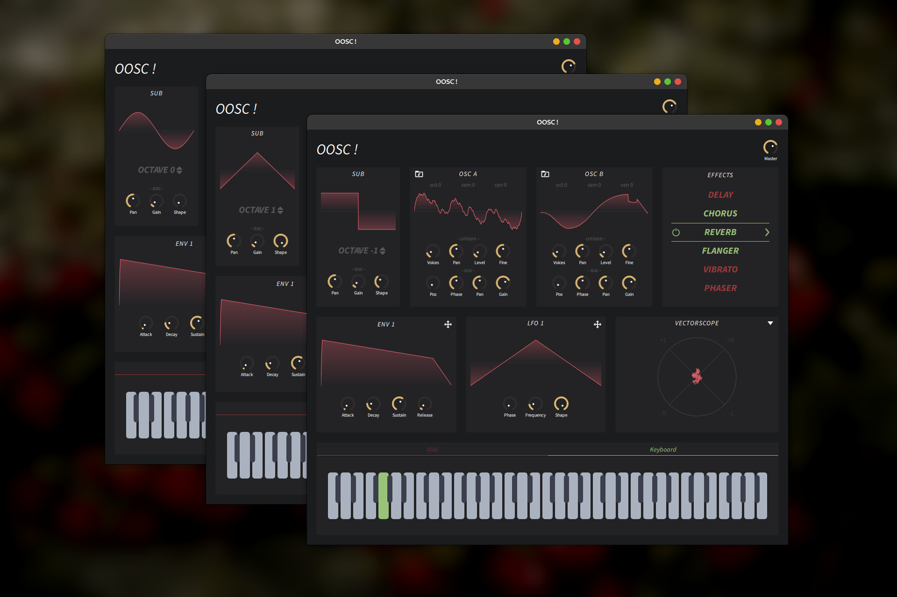

# 🎹 OOSC!

OOSC is a two-oscillator wavetable driving synthesizer written with Qt, QML and C++. Have some included effects
like a Reverb, Flanger, EQ etc. Built-in MIDI-file playback. Support automation 
using ADSR and LFO. Visualized audio output by channel, vectorscope, FFT.



## 🎼 Oscillator features
- Load wavetable from any wav-file
- User-control parameters
    - Pan, Gain, Wavetable position, Phase, Octave offset, Semitone offset,
      Cents, Unison voices, Unison cents range, Unison gain range
- Seed for unison randomization
- Multi-thread

## 📈 Envelope features
- Simple Attack-Decay-Sustain-Release, but..
- Cubic Bézier curves for transition 
- May be connected to any user-controlled parameter

## 🐢 Low-frequency oscillator features
- Four shapes
    - Sine, Sawtooth, Triangle, Square
- Changeable frequency & phase
- May be connected to any user-controlled parameter

## 🔮 Visualization
- Left & Right output wave 
- Vectorscope
- Fast Fourier Transform

## ✨ Effects
- Delay, Chorus, Phaser, Flanger, Reverb, Distortion, Vibrato, EQ, Compressor

## 🔧 Build

```bash
cmake -S <project_directory> -B <build_directoty>
cmake --build <configuration>
```
For example:
```bash
cmake -S . -B Debug
cmake --build Debug
```
<configuration\> is Debug, Release, MinSizeRel, or RelWithDebInfo.

... or just open as projects in QtCreator, CLion or any other 
c++ IDE, that support CMake and build.

## 🔩 Requirements

- Cxx11 +
- Qt 5.15 +
- Portaudio API 2.0
- CMake 3.14 + 

## 💡 In-develop
- [ ] Adaptive UI
- [ ] Connect envelope to oscillators
- [ ] Bézier curves visual editor
- [ ] Render to wav
- [ ] Wavetable-based LFO

## 🎨 Data location
- Linux
    - Wavetables "~/.local/share/oosc/Wavetables/<your_package\>"
    - MIDI "~/.local/share/oosc/Midi/<your_package\>"
- MacOs
    - Wavetables "~/Library/Application Support/oosc/Wavetables/<your_package\>"
    - MIDI "~/Library/Application Support/oosc/Midi/<your_package\>" 
- Windows
    - Wavetables "C:/Users/<user\>/AppData/Local/oosc/Wavetables/<your_package\>"
    - MIDI "C:/Users/<user\>/AppData/Local/oosc/Midi/<your_package\>"
